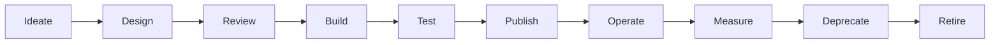

# 03 — API Lifecycle

```mermaid
flowchart LR
  I[Ideate] --> D[Design]
  D --> R[Review]
  R --> B[Build]
  B --> T[Test]
  T --> P[Publish]
  P --> O[Operate]
  O --> M[Measure]
  M --> X[Deprecate]
  X --> Z[Retire]
```

L'architecte définit les quality gates, pas seulement le runtime.
