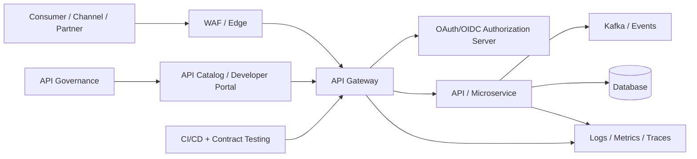
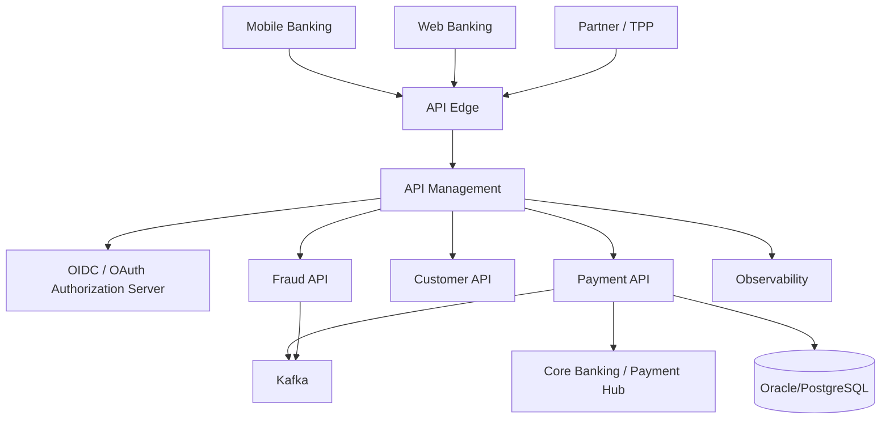

# MayaBank — API Management Solution Architecture

Référentiel professionnel et laboratoire différé pour apprendre, concevoir et challenger une architecture **API Management banque/assurance**.

## Positionnement visé

**Architecte Solution — API Management / Integration / Security — OpenShift / Kafka / Cloud**

Le dépôt est **vendor-neutral** : les principes d'architecture sont valables pour **Apigee, Kong, MuleSoft Anypoint, Axway Amplify** et autres plateformes. Les labs locaux privilégient **Kong Gateway + Keycloak + OpenShift Local/CRC** lorsqu'un produit exécutable localement est nécessaire.

## Livrables d'architecture directement démontrables

- [HLD — architecture de haut niveau](architecture/HLD.md)
- [LLD — design détaillé](architecture/LLD.md)
- [UML Component](diagrams/uml/component.puml)
- [UML Sequence — création paiement](diagrams/uml/sequence-payment-create.puml)
- [UML Deployment — OpenShift](diagrams/uml/deployment-openshift.puml)
- [OWASP API Security Top 10 — mapping architecture](security/OWASP-API-Security-Top10-2023.md)
- [Claim / Evidence Matrix](evidence/CLAIM-EVIDENCE-MATRIX.md)
- [OpenAPI Payment API](apis/openapi/payment-api.yaml)
- [AsyncAPI Payment Events](apis/asyncapi/payment-events.yaml)

Ces artefacts sont des **preuves de conception**. Les claims runtime restent séparés et ne sont promus qu'après exécution observée.

## Chaîne cible

## Ce qu'un Architecte Solution API Management doit savoir faire

- définir la stratégie API et les principes d'architecture ;
- distinguer API Gateway, API Management, ESB/iPaaS, service mesh et ingress ;
- concevoir une API REST/HTTP avec OpenAPI ;
- concevoir une API événementielle avec AsyncAPI ;
- gérer le cycle de vie : design, review, publish, secure, observe, deprecate, retire ;
- définir les politiques de sécurité OAuth/OIDC, mTLS, JWT, scopes, consentement, DPoP/FAPI selon le risque ;
- concevoir le north-south et l'east-west ;
- définir quotas, rate limits, timeouts, retries, circuit breakers et idempotence ;
- définir l'observabilité et les SLO ;
- intégrer OpenShift/Kubernetes, Kafka, IAM, SI legacy et cloud ;
- arbitrer Apigee vs Kong vs MuleSoft vs Axway ;
- définir gouvernance, RACI, standards, ADR et architecture de référence ;
- produire et défendre HLD, LLD, UML, threat model et décisions d'architecture ;
- expliquer les choix devant sécurité, production et métier.

## Standards de référence — baseline 2026

- OpenAPI Specification **3.2.1**
- AsyncAPI Specification **3.1.0**
- OAuth 2.0 + **RFC 9700**
- OpenID Connect
- PKCE
- mTLS / sender-constrained tokens selon les cas
- **FAPI 2.0** pour les API à haut niveau de sécurité
- **OWASP API Security Top 10 — 2023** comme baseline de revue
- OAuth 2.1 : à suivre comme **Internet-Draft**, pas comme RFC final dans cette baseline

## Parcours

1. [Roadmap](00-roadmap/README.md)
2. [Fondations API](01-foundations/README.md)
3. [API Design](02-api-design/README.md)
4. [API Lifecycle](03-api-lifecycle/README.md)
5. [API Security](04-api-security/README.md)
6. [Gateway Architecture](05-api-gateway/README.md)
7. [Comparaison plateformes](06-platforms/README.md)
8. [Gouvernance](07-governance/README.md)
9. [Observabilité](08-observability/README.md)
10. [Résilience & performance](09-resilience-performance/README.md)
11. [Event Driven / Kafka](10-event-driven/README.md)
12. [OpenShift](11-openshift/README.md)
13. [Banque / Open Banking](12-banking/README.md)
14. [Enterprise Integration](13-enterprise-integration/README.md)
15. [ADR](14-architecture-decisions/README.md)
16. [POC MayaBank](15-mayabank-poc/README.md)
17. [Entretien](16-interview-preparation/README.md)
18. [Labs à exécuter](labs/README.md)

## Règle de preuve

Les labs sont préparés mais **non exécutés**. Leur statut est `À EXÉCUTER` jusqu'à preuve réelle. La [Claim / Evidence Matrix](evidence/CLAIM-EVIDENCE-MATRIX.md) est la source de vérité sur le niveau de preuve.

## Architecture MayaBank

## Positionnement honnête

Ce dépôt démontre une capacité de **conception Solution Architecture** : HLD/LLD, contrats, UML, API security, ADR, intégration, gouvernance et préparation de POC. Il ne remplace pas plusieurs années d'expérience de production sur Apigee, Kong, MuleSoft ou Axway et ne revendique pas un runtime end-to-end tant que les labs correspondants ne sont pas exécutés.
