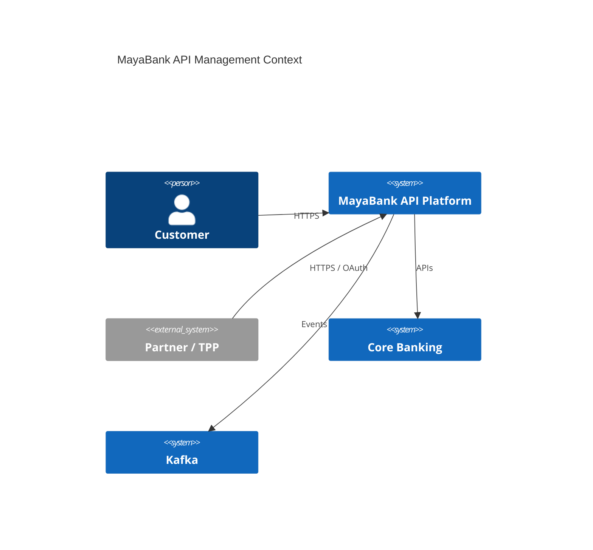

# Diagrammes

```mermaid
C4Context
title MayaBank API Management Context
Person(customer, "Customer")
System(api, "MayaBank API Platform")
System_Ext(partner, "Partner / TPP")
System(core, "Core Banking")
System(kafka, "Kafka")
Rel(customer, api, "HTTPS")
Rel(partner, api, "HTTPS / OAuth")
Rel(api, core, "APIs")
Rel(api, kafka, "Events")
```
