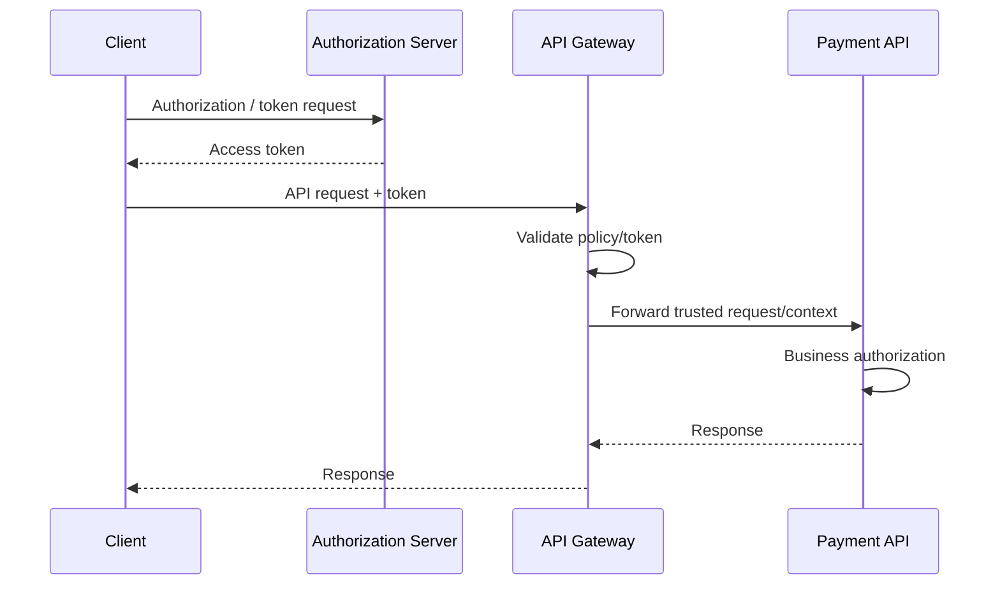

# Security Flow

```mermaid
sequenceDiagram
  participant C as Client
  participant AS as Authorization Server
  participant G as API Gateway
  participant A as Payment API
  C->>AS: Authorization / token request
  AS-->>C: Access token
  C->>G: API request + token
  G->>G: Validate policy/token
  G->>A: Forward trusted request/context
  A->>A: Business authorization
  A-->>G: Response
  G-->>C: Response
```
